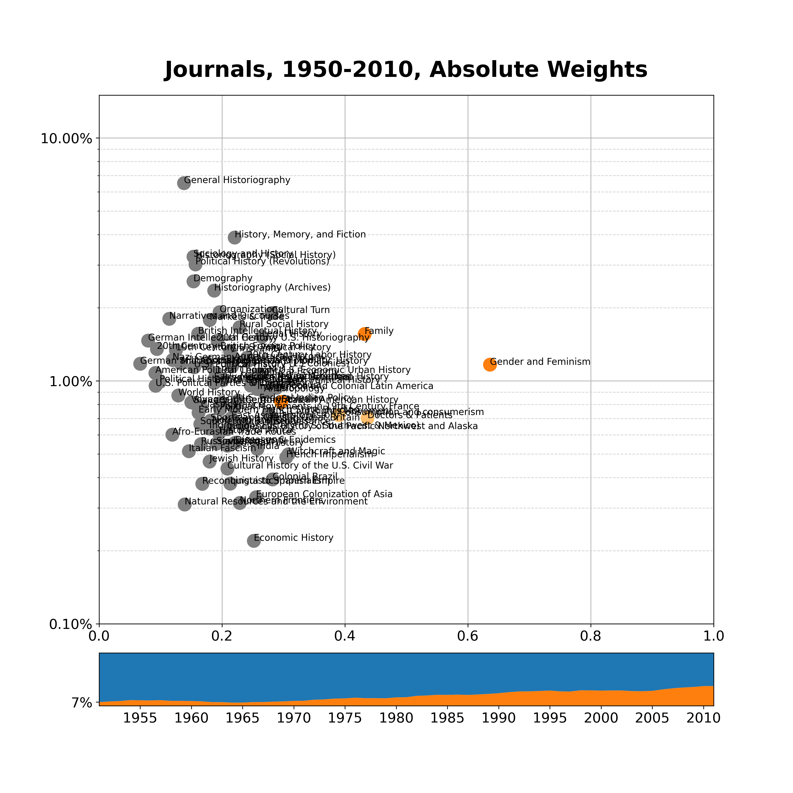

# Scatterplots over Time

Let's look at some scatterplots again--and this time, including dissertation data and decade by 
decade plots. 

Here's the general picture for journals, including the whole dataset.

You may notice a couple of changes. 

First off, the bar at the bottom tells you the percentage of women who published articles, 
starting at 7% in 1951. 

I left all of the labels in. Obviously, for the publication, I'll only label some of the topics
but it seemed useful to have them for now (even though the centers are messy bundles of letters).

Within the chart, I have colored the women's and gender history topics in orange. I'm using
a more narrow definition here than we had used in the past and only include Gender and
Feminism, Family, and Sexuality (the dot more towards the center). As I'm thinking about it, 
I think it's actually useful that sexuality is more in the center. Partially, this is because 
of the male-dominated Freud peak in the 1970s. But it's also because (I think) a substantial 
number of men, drawing on gender history, have written about gay history. 

There are two other dots in lighter orange, Doctors and Patients, and Consumption and Consumerism.
We had labeled them under the general approach Women's and Gender History in the past but I think
it's more appropriate to label them as topics that women either built or helped build. (I might
also be convinced to consider the Cultural Turn topic in this group if only for its clear contrast
with the male-dominated Discourses and Narratives topic.)

## Topics by absolute weight contribution

Ok, next up is a mean chart. But a peer reviewer might bring this up. The chart above (and the 
ones following the one below) compare topic weights among men and women. The formula is simply 
topic_weight_women / (topic_weight_men + topic_weight_women). This tells us in what topics men
and women are overrepresented. But it doesn't account for the fact only 20% of the articles in 
our dataset were written by women. 

An alternative way of presenting the data is by looking at the total weight contributed by men and 
women to a topic. Since men outnumber women 4 to 1, they have contributed about 4 times more in
this chart. Here's how that looks:

With this adjustment, only contributions to gender and feminism remain dominated by women.
Obviously, men shouldn't get credit simply for outnumbering women but it might make
some arguments about what would we not know without women more complicated.

## Comparison to dissertations

Here's the overall chart for dissertations. Note that journals go back to 1950. We'll
compare the two datasets more closely on a decade by decade basis.

# 1960s

Men: 1053 articles

Women: 79 articles

In British Early Modern, France, and India, women are overrepresented but they're
still a tiny number.

Don't pay too much attention to anything below 0.5% topic weight.

# 1970s:

Men: 1380 articles

Women: 207 articles

We're definitely starting to get two of the traditional women's and gender history topics:
"Family" and "Gender and Feminism".

The third orange dot is sexuality--we're in the Freudian age.

Also worth noting: except for gender and feminism, all topics with a weight > 0.5% are between
0.2 and 0.8.

# 1980s

Men: 1437 articles, 3755 dissertations

Women: 352 articles, 1869 dissertations

Damn, that's an immense difference. During the 1980s, men write twice as many dissertations but
four times as many articles.

Ah yes, also the first decade for which we have dissertation data. 

Family and gender and feminism are still going strong. Doctors and patients makes for a good 
candidate as a topic that women introduced or helped establish.

### Do dissertations and journals show similar patterns?

Mostly, I would say so. It's definitely notable that most topics other than gender and feminism are
bunched together in the center. But it's also the same topics that skew female (family, doctors
and patients, consumption and consumerism) or male (military and political history). The large number
in sociology and history and social history seems right for the 1980s. 

# 1990s

Men: 1522 articles, 4187 dissertations

Women: 565 articles, 2814 dissertations

World History and Narratives and Discourses (critical theory with some intellectual history) are new
male-dominated topics. However, that trend does not appear in the dissertations. There's probably
good reasons for that. World History deals with big, universal history, which is not a topic for
dissertations and theory debates will usually not make it into the abstract of a history 
dissertation.

# 2000s

Men: 1125 articles, 4237 dissertations

Women: 509 articles, 3140 dissertations

Women are now clearly overrepresented in the sexuality topic while consumption and consumerism has 
moved more towards the center. I'm tired, so I'll let you make your own interpretations.

