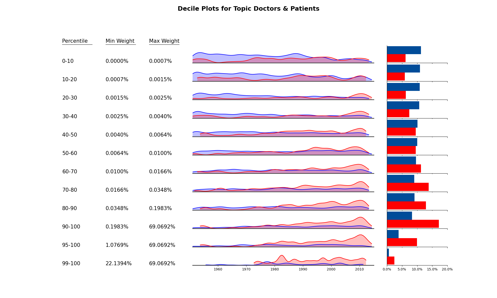

# Percentile Plots

How does a new topic emerge? How does it move from a small group to mainstream adoption? How does
a topic vanish? And how can we show this process?

My attempt to grapple with these questions are the following percentile plots. 

Before going further, let's have a look at one of them. And let's select one
that we don't particularly care about before getting into more gender related topics.

What's going on here?

Each row shows when articles falling into a certain percentile range were
published. 

Take the 90-100 percentile (3rd from the bottom). These are all articles that
score between the 90th and 100th percentile for the Holocaust topic, i.e. these
are the 10% of our articles that most actively discuss the Holocaust topic.

What do we see? I think there are two observations to be made.
- The Holocaust topic is quite recent. The vast bulk of high-scoring articles
was published after 1990.
- Articles published by women have a higher chance of being in the top decile.

The three bottom deciles show the opposite, i.e. most articles scoring low for
the Holocaust topic were written by men in from the 1950s to the 1980s. One interpretation
of this finding is that the words associated with the Holocaust topic, 
including "memory," "film", and "photography" are hard to ignore. As a historian
dealing with almost any topic, you will have to engage with them.

On the right, you can see what percentage of male and female authored articles
fall into each range.

Most of the rows show deciles: 0-10, 10-20, ... 80-90, 90-100. However, 
there are also rows for the top 5% (95-100) and top 1% (99-100). My hope
is that these will show the leaders in the field a bit more clear. Given
that we have about 10000 articles, the top 1% is still made up of 100 articles.  

The top percentile is worth having a look at. Unlike the top decile, it shows men and women
contributing almost equally. 

Before we look at plots that are more relevant for us, let me note that you can find
plots for all topics and general approaches [here](https://github.com/srisi/gender_history/tree/master/visualizations/topic_percentile_plots)

## Women's and Gender History

With introductions out of the way, let's have a look at the 
"Women's and Gender History" general approach:

And, not unexpected, women are vastly overrepresented in the top 10%. Almost
30% of all articles published by women score in the top decile for women's and
gender history. 

Somewhat similar to the analysis [here](https://github.com/srisi/gender_history/blob/master/writeups/gender_topics.md#the-history-of-womens-and-gender-history), 
1970 seems like a good start date for when women's and gender history becomes a thing of 
its own as it's the time when we see publications in the top decile. And, it's also worth noting
that publications in the top 1% really kick in around 1980. I think the top 1% publications are 
important because those are probably the ones doing a lot of explanatory work. 

Has women's and gender history become unavoidable, i.e. does everyone have to write about it a little
bit? Less so than for the Holocaust topic above with its "memory" and "film" related terms. The number
of men in the bottom deciles has certainly dropped but not vanished. And the number of women in the
bottom deciles has remained stable, if anything, it has increased slightly. 

Part of the explanation probably lies with the fact that we're throwing multiple topics into one pot, 
namely, in addition to "gender and feminism," this group includes
 "family," "sexuality," and "consumption and consumerism." If these are
just not the topic someone writes about, they will score low for the general approach.

## Gender and Feminism

So let's switch to "gender and feminism."

Gender and feminism shows many of the trends of the general approach, just more pronounced. Men
almost don't exist in the top 1%. Also, we can see publications in the top decile ramping up in the 1970s but top percentile 
publications really dominate in the 1980s and early 90s. I think we can say that it's during those
times that gender becomes established as a framework.

Also note that in particular the bottom decile does decline significantly after 1990, i.e. gender
does become harder to avoid completely. There are still many publications from the 10th to the 50th 
decile, though.

Also, about 18% of all articles written by women score in the top 5% for this topic.

## Doctors and Patients

Doctors and Patients is a a good candidate for a topic that women helped to establish. Look in
particular at the top 5% and top 1%. Those are the articles that really establish the topic and
women clearly dominate here.

## Consumption and Consumerism

Consumption and consumerism shows a similar story.

## Sports and Class in Great Britain

Sports and class in GB is strange topic in that [I had found](https://github.com/srisi/gender_history/blob/master/writeups/gender_topics.md)
that the topic was quite distinctive for women and yet, it's almost exclusively men who have written
the articles that score the highest for this topic. 

I think the percentile plot can help a little:

Yes, women are over-represented from the 50th to the 99th percentile. However in the top 1%, men
outnumber women 2 to 1.

Finally, I think there's more to be found in these plots. You can find a complete list 
[here.](https://github.com/srisi/gender_history/tree/master/visualizations/topic_percentile_plots)

